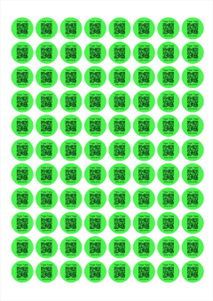
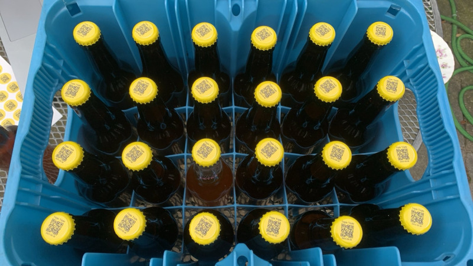

# Bottle Cap Avery 20-RND

A simple tool to design bottle cap stickers using the
[Avery 20-RND](https://www.avery.nl/onbedrukte-etiketten/ronde-20mm) sticker sheet.

I use these to identify the the beers I brewed without the need to ruin the
bottles with a temporary label.

The layout of the stickers is highly opinionated:

*  The name of the beer.
*  QR-code pointing to an URL[^1].
*  The date the beer was bottled.

[^1]: I use the public URL to my batch at [Brewfather](https://brewfather.app/).

## How to use

Download the file `index.html` and open it in your webbrowser, or head to
[this project's GitHub page](https://robinelfrink.github.io/bottle-cap-avery-20-rnd/).
I've only tested Chrome so far.
tested Chrome so far.

Fill out the form, and click on the button. Print the resulting PDF on
regular paper, just to check if you need to adjust the offsets (some printers,
such as mine, add an extra millimeter here and there).

If you're happy with the result, print the PDF on the Avery 20-RND sticker
sheet. Stick the stickers on the bottle caps.

## Example

Here's how this looks on one of my brews:

## Development

I'm happy to accept pull requests, as long as they don't interfere with what
I think is the best layout :blush:

## Acknowledgement

All this has been made possible by
[jsPDF](https://github.com/parallax/jsPDF) and
[node-qrcode](https://github.com/soldair/node-qrcode).
